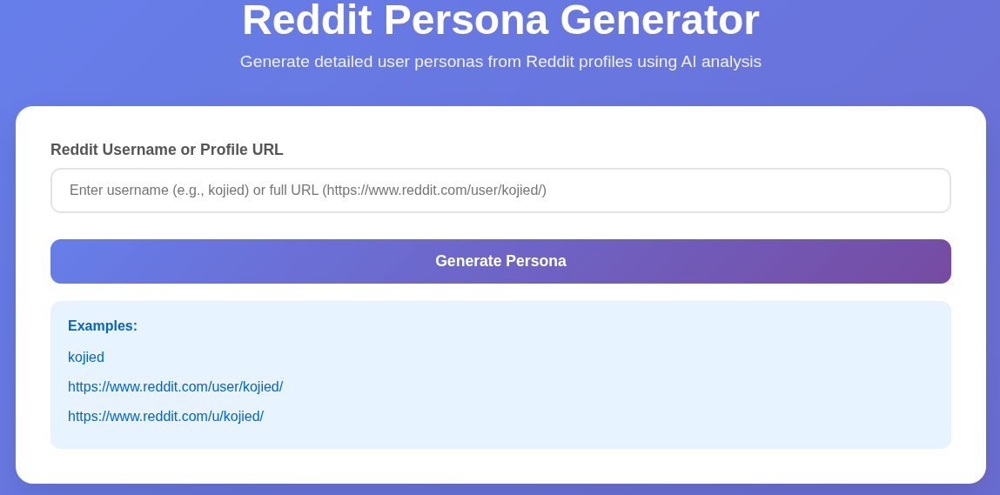
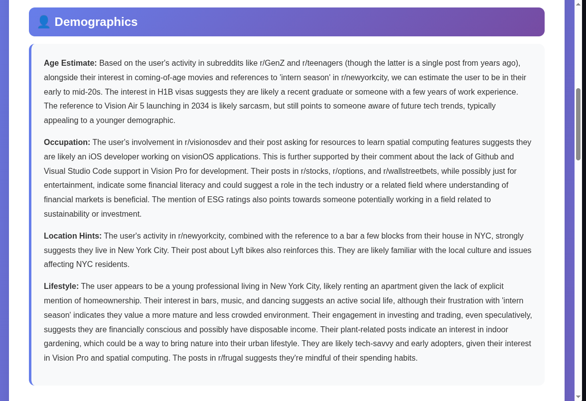
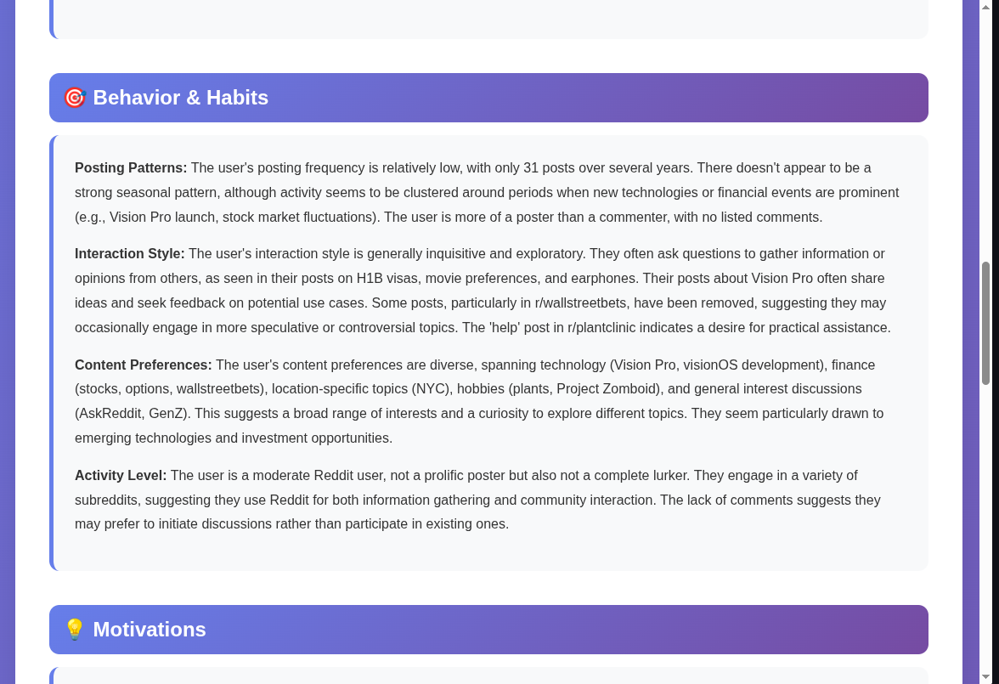
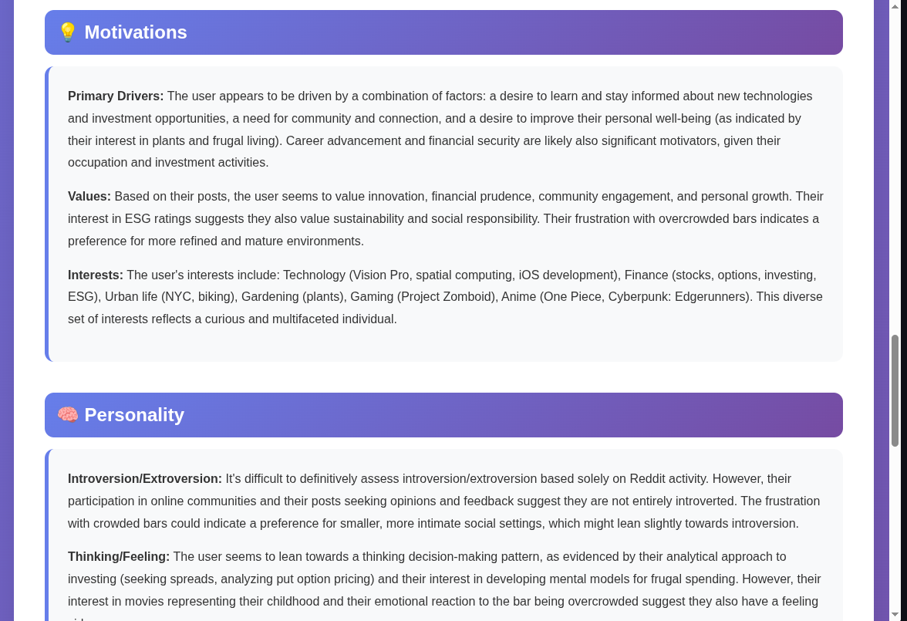
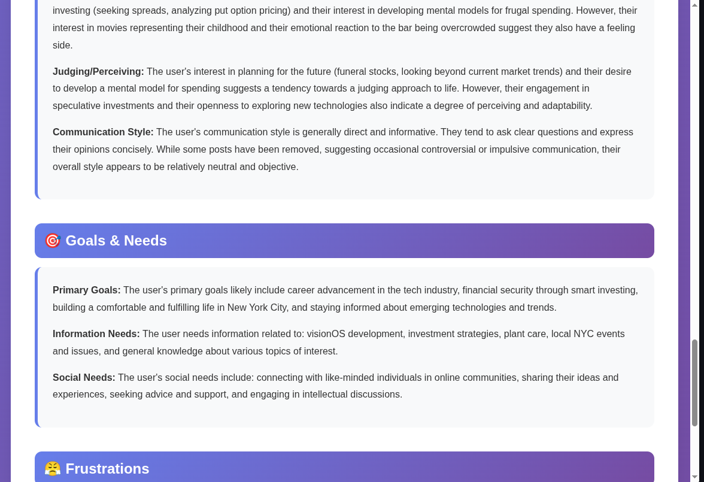
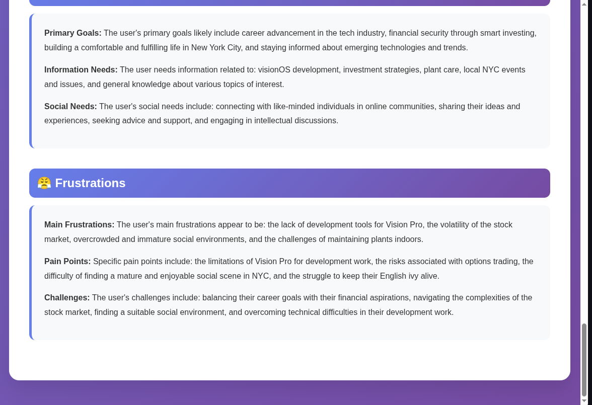

# Reddit Persona Generator

An AI-powered tool that analyzes Reddit user profiles to generate detailed user personas using Google's Gemini AI.

## Screenshots













## Features

- **Reddit Data Scraping**: Extracts posts, comments, and profile information from public Reddit accounts
- **AI Analysis**: Uses Google Gemini AI to generate comprehensive user personas
- **Web Interface**: Clean Flask-based web application
- **Command Line Interface**: Direct CLI usage for batch processing
- **Detailed Personas**: Generates insights on demographics, behavior, motivations, personality, and more

## Setup

### Prerequisites

- Python 3.11+
- Reddit API credentials (Client ID and Secret)
- Google Gemini API key

### Installation

1. Clone the repository:
```bash
git clone https://github.com/devansh0703/RedditPersonaBuilder.git
cd RedditPersonaBuilder
```

2. Install dependencies:
```bash
pip install -r requirements.txt
```

### Environment Variables

Set the following environment variables:

```bash
export REDDIT_CLIENT_ID="your_reddit_client_id"
export REDDIT_CLIENT_SECRET="your_reddit_client_secret"
export GEMINI_API_KEY="your_gemini_api_key"
```

#### Getting Reddit API Credentials

1. Go to https://www.reddit.com/prefs/apps
2. Click "Create App" or "Create Another App"
3. Choose "script" as the app type
4. Note down the Client ID (under the app name) and Client Secret

#### Getting Gemini API Key

1. Go to https://aistudio.google.com/app/apikey
2. Create a new API key
3. Copy the API key

## Usage

### Web Interface

Start the Flask web application:

```bash
python app.py
```

Visit `http://localhost:5000` and enter a Reddit profile URL.

### Command Line Interface

Generate a persona for a specific Reddit user:

```bash
python reddit_persona_generator.py https://www.reddit.com/user/username/
```

Options:
- `--output-dir`: Specify output directory (default: `personas`)
- `--verbose`: Enable verbose logging

## Output

The tool generates detailed persona reports including:

- **Demographics**: Age estimate, occupation guess, location hints, lifestyle
- **Behavior & Habits**: Posting patterns, interaction style, content preferences
- **Motivations**: Primary drivers, values, interests
- **Personality**: Communication style, psychological traits
- **Goals & Needs**: Primary goals, information needs, social needs
- **Frustrations**: Main frustrations, pain points, challenges

Reports are saved as text files in the `personas/` directory.

## Configuration

Key settings in `config.py`:

- `MAX_POSTS`: Maximum posts to analyze (default: 1000)
- `MAX_COMMENTS`: Maximum comments to analyze (default: 2000)
- `REQUEST_DELAY`: Delay between API requests (default: 0.5s)

## Privacy & Ethics

This tool only analyzes publicly available Reddit data. Users should:

- Respect Reddit's terms of service
- Use responsibly and ethically
- Consider privacy implications
- Obtain consent when analyzing others' profiles
